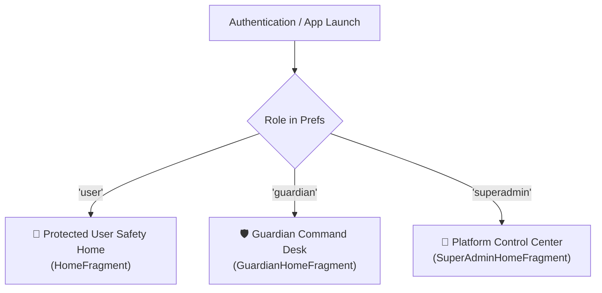
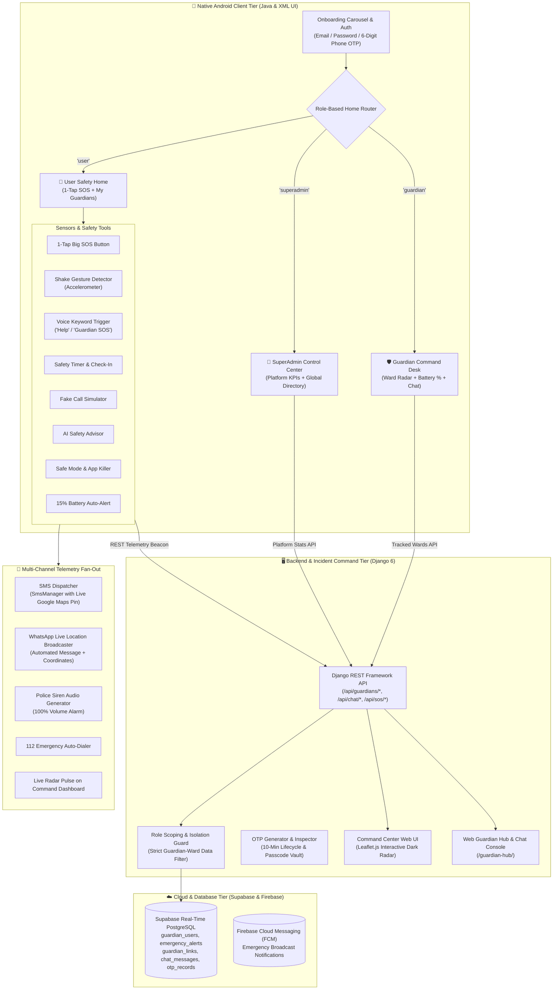
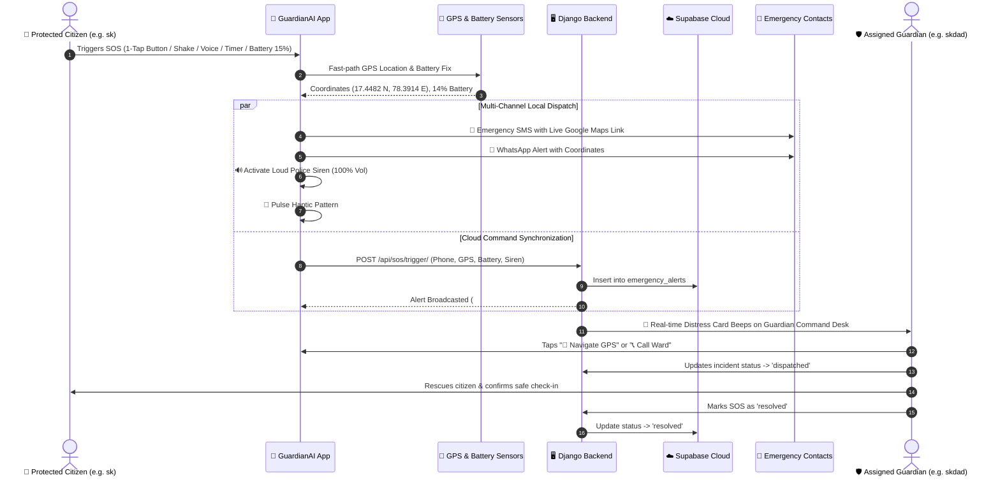

<div align="center">
  # 🛡️ GuardianAI
  ### *Autonomous Women Safety, Telemetric Emergency Response, Multi-Role Command & Guardian Ecosystem*

  [-3DDC84?style=for-the-badge&logo=android&logoColor=white)](https://raw.githubusercontent.com/satyakiran29/GuardianAI/main/Apk/GuardianAI-debug.apk)
  [](https://developer.android.com/)
  [](https://www.djangoproject.com/)
  [](https://supabase.com/)
  [](LICENSE)

  <p align="center">
    <a href="#-downloads--release-artifacts">📱 Download Latest APK</a> •
    <a href="#-dedicated-role-based-dashboards">🛡️ Role Dashboards</a> •
    <a href="#-system-architecture">🏗️ Architecture</a> •
    <a href="#-multi-role-access-control--data-isolation">👥 Role Isolation</a> •
    <a href="#-rest-api-reference">🔌 REST API</a> •
    <a href="#-installation--setup-guide">🚀 Setup Guide</a>
  </p>
</div>

---

## 📌 Table of Contents
1. [Overview & Mission](#-overview--mission)
2. [Downloads & Release Artifacts](#-downloads--release-artifacts)
3. [Dedicated Role-Based Dashboards](#-dedicated-role-based-dashboards)
4. [Multi-Role Access Control & Data Isolation](#-multi-role-access-control--data-isolation)
5. [End-to-End System Architecture](#-end-to-end-system-architecture)
6. [Emergency SOS Telemetry & Dispatch Flowchart](#-emergency-sos-telemetry--dispatch-flowchart)
7. [Guardian Link & Real-Time Safety Chat](#-guardian-link--real-time-safety-chat)
8. [Comprehensive Features Breakdown](#-comprehensive-features-breakdown)
9. [Django & Supabase Cloud Command Dashboard](#-django--supabase-cloud-command-dashboard)
10. [REST API Reference](#-rest-api-reference)
11. [Installation & Setup Guide](#-installation--setup-guide)
12. [Automated Verification Test Suite](#-automated-verification-test-suite)
13. [Engineering Team & Credits](#-engineering-team--credits)

---

## 🌟 Overview & Mission

**GuardianAI** (also known as *SheGuard*) is an autonomous personal safety, live telemetry escort, and emergency incident dispatch ecosystem designed specifically for women, vulnerable citizens, and security teams.

The platform connects a native **Android Client (Java + XML UI)** with an intelligent **Django 6 + Supabase Cloud Incident Command Center**, offering multi-modal panic detection, ward-to-guardian live tracking, critical low-battery alerts, real-time safety chat, and cryptographic 6-digit OTP security.

---

## 📥 Downloads & Release Artifacts

| Artifact | Version | File Size | Direct Download |
| :--- | :---: | :---: | :--- |
| **Android Safety App (Debug APK)** | **v1.1.3 (Build 13)** | ~16.8 MB | [Download GuardianAI-debug.apk](https://raw.githubusercontent.com/satyakiran29/GuardianAI/main/Apk/GuardianAI-debug.apk) |
| **OTA Update Manifest** | **v1.1.3** | ~710 B | [View update.json](https://raw.githubusercontent.com/satyakiran29/GuardianAI/main/Apk/update.json) |
| **Backend Release Package** | **v1.1.3** | ~16.8 MB | [Backend APK Release](https://raw.githubusercontent.com/satyakiran29/GuardianAI/main/Backend/GuardianAI-Safety-Debug.apk) |

### 🆕 What's New in v1.1.3 (Build 13)

| # | Fix / Feature | Area |
|---|---|---|
| ✅ | **Guardian filter fixed** — `[Guardians]` tab correctly shows all guardian-role accounts; switching tabs clears the search to avoid conflicts | SuperAdmin UI |
| ✅ | **Chat location fixed** — "📍 Send Location" chip now sends a real `maps.google.com/?q=LAT,LNG` link using device's last saved GPS coordinates | Safety Chat |
| ✅ | **Location persistence** — `pingLocation()` saves lat/lng to device storage so chat chip always has fresh coordinates between SOS events | Android Client |
| ✅ | **Guardian role fetching** — Backend identity lookup now resolves by username, email prefix, name, and phone number — fixes "Guardian Not Found" errors | Django Backend |
| ✅ | **Guardian Command Desk overhaul** — Live ward radar with battery color indicators, empty-state quick-actions (`+ Pair Ward` / `⚡ Sample Radar`) | Android UI |
| ✅ | **SuperAdmin Command Center** — High-contrast KPI icons (👥🛡️🚨🔋), readable bold-white filter tabs with Indigo active state | Android UI |

---

## 🛡️ Dedicated Role-Based Dashboards

GuardianAI features **3 distinct, tailored mobile experiences** based on the authenticated user's role:



### 1. 🛡️ Guardian Command Desk (`GuardianHomeFragment`)
- **Active Protector Header**: Unit status badge, protector name, and phone.
- **🚨 Critical Distress Emergency Card**: Appears with high-priority red styling when an assigned ward triggers an SOS, offering instant **1-Click Call Ward** (`ACTION_DIAL`) and **Navigate GPS** (`Google Maps Intent`).
- **Live Ward Radar**: Displays live battery percentage gauges (green >30%, orange <30%, red critical low ≤15%), real-time street address, and live coordinates.
- **Direct Ward Actions**: Quick-access **💬 Live Chat**, **📞 Call**, and **📍 Map Radar** on every ward card.
- **Protector Controls**: `+ Link Ward` dialog and `📡 Ping GPS` to share current guardian coordinates.
- **Background Polling**: Automatically refreshes ward telemetry every 15 seconds.

### 2. 👑 SuperAdmin Platform Control Center (`SuperAdminHomeFragment`)
- **Executive KPI Metrics Grid (2x2)**:
  - 👥 **Total Users**: Platform registered citizen count.
  - 🛡️ **Guardian Units**: Active responder units deployed.
  - 🚨 **Active SOS**: Live emergency distress incidents.
  - 🔋 **Low Battery**: Citizens with critical battery (<15%).
- **Live SOS Monitor**: System-wide broadcast feed for active emergency alerts across all registered citizens.
- **Global User & Guardian Directory**: Live search by name, phone, or email with filter chips (`[All]`, `[Users]`, `[Guardians]`) and direct chat/call triggers.

### 3. 🌸 Protected User Safety Home (`HomeFragment`)
- Consumer safety suite featuring the large pulsating **1-Tap SOS button**, Shake-to-SOS listener, Voice keyword trigger, Fake Call simulator, Safe Ride monitor, Safety Timer, and **🛡️ My Guardians** escort directory.

---

## 👥 Multi-Role Access Control & Data Isolation

To protect citizen privacy, GuardianAI enforces strict data scoping across all tiers:

| Role | Badge | Guardian Portal Access | Data Visibility Scope | Example Scenario (`sk` & `skdad`) |
| :--- | :---: | :---: | :--- | :--- |
| **Protected User** | `🌸 USER` | ❌ **Blocked (`403 Forbidden`)** | Can **ONLY** view their assigned guardians via **"My Guardians"**. Guardian Portal telemetry is restricted. | `sk` accesses My Guardians to view `skdad`. Cannot access other citizens' telemetry. |
| **Guardian** | `🛡️ GUARDIAN` | ✅ **Allowed** | **Strictly isolated**: Can **ONLY** track and view data for their assigned wards. | `skdad` **ONLY** sees `sk` on their radar and chat. Cannot see wards of other guardians. |
| **SuperAdmin** | `👑 SUPERADMIN` | ✅ **Allowed** | **Omniscient access**: Full platform visibility over all users, guardians, wards, and incidents. | SuperAdmin monitors all platform telemetry, audits OTP logs, and oversees dispatches. |

---

## 🏗️ End-to-End System Architecture



---

## 🚨 Emergency SOS Telemetry & Dispatch Flowchart



---

## 💬 Guardian Link & Real-Time Safety Chat

- **Guardian Link Pairing**: Connects protected users with trusted guardians with relational roles (`Father`, `Mother`, `Brother`, `Patrol Unit`, `Friend`).
- **Direct In-App Safety Chat**: Two-way interactive messaging between wards and guardians.
- **Quick-Reply Presets**: One-tap situational presets (*"I have reached safely!"*, *"Call me immediately"*, *"Low battery, tracking active"*, *"Please stay on call"*).
- **Live Battery Indicator**: Partner's live battery status is pinned in the chat app bar with color-coded warnings.

---

## ⚡ Comprehensive Features Breakdown

### 📱 Android Application (Java & XML UI)
- **Role-Based Dynamic Start**: Auto-routes to `GuardianHomeFragment`, `SuperAdminHomeFragment`, or `HomeFragment` based on session credentials.
- **1-Tap Panic SOS**: Prominent pulsating emergency button with countdown cancellation.
- **Shake Detection**: Accelerometer listener that triggers SOS on vigorous device shake.
- **Voice SOS Keywords**: Hands-free trigger using phrases (*"Help"*, *"Guardian SOS"*, *"Save Me"*).
- **Fake Call Simulator**: Realistic incoming call simulator with customizable caller names (*Mom 💖*, *Police Inspector*) and automated ringtones to gracefully escape hostile environments.
- **24/7 AI Safety Assistant**: Crisis advisor offering actionable guidance on stalking, public transit safety, self-defense, and legal rights.
- **Safe Mode Engine**: Terminates high-consumption background apps to maximize emergency battery life and broadcasts location via WhatsApp and SMS.
- **Safety Timer & Dead-Man Switch**: Countdown timer requiring safe check-in before automatic SOS escalation.
- **Taxi & Ride Monitoring**: Logs cab numbers and driver details with route diversion alerts.
- **15% Critical Battery Broadcast**: Automatic emergency GPS ping before device power depletion.
- **3 Home Screen Widgets**: 1-Tap SOS (2x2), Guardian Safety Hub (4x2), and Quick Safety Bar (4x1).
- **Multilingual Support**: Fully localized in **English 🇬🇧**, **Telugu 🇮🇳 (తెలుగు)**, and **Hindi 🇮🇳 (हिन्दी)**.
- **Themes**: Light, Dark, and Pure AMOLED Black mode 🖤.

### 🖥️ Django Web Command Dashboard
- **Interactive Leaflet.js Radar**: Live map tracking with pulsing red SOS rings and green guardian units.
- **Guardian Hub & Telemetry Desk (`/guardian-hub/`)**: Live web tracking console with real-time battery bars and embedded chat.
- **User Directory & Privilege Elevation**: Filter, search, and manage roles with assigned guardian links.
- **Live OTP Simulator & Ledger**: Visual inspection of 6-digit OTP transactions and expiry status.

---

## 🔌 REST API Reference

### 🔐 Authentication & Accounts
| Endpoint | Method | Role Required | Description | Sample Payload |
| :--- | :---: | :---: | :--- | :--- |
| `/api/auth/send-otp/` | `POST` | Any | Dispatch 6-digit verification OTP | `{"target": "+919876543210", "purpose": "login"}` |
| `/api/auth/verify-otp/` | `POST` | Any | Validate 6-digit passcode | `{"target": "+919876543210", "otp_code": "123456"}` |
| `/api/auth/register/` | `POST` | Any | Register account with role | `{"name": "Priya", "phone": "+919876543210", "role": "user"}` |
| `/api/auth/login/` | `POST` | Any | Sign in via password or phone OTP | `{"identifier": "+919876543210", "password": "pass"}` |

### 🛡️ Guardian Management & Wards Radar
| Endpoint | Method | Role Required | Description | Sample Parameters / Payload |
| :--- | :---: | :---: | :--- | :--- |
| `/api/guardians/tracked-wards/` | `GET` | `guardian`, `superadmin` | Fetch live wards telemetry (Battery %, GPS, SOS). **Denied to `user` (403)** | `?guardian_phone=+919988776655` |
| `/api/guardians/my-guardians/` | `GET` | `user`, `superadmin` | Fetch user's assigned guardians | `?phone=+919876543210` |
| `/api/guardians/link/` | `POST` | `user`, `guardian`, `superadmin` | Create active guardian-ward link | `{"user_phone": "+91...", "guardian_phone": "+91...", "relationship": "Father"}` |
| `/api/guardians/link/` | `DELETE` | Any linked party | Revoke guardian link | `{"link_id": 1}` |

### 💬 Safety Chat
| Endpoint | Method | Role Required | Description | Sample Payload |
| :--- | :---: | :---: | :--- | :--- |
| `/api/chat/send/` | `POST` | Linked party | Send safety message | `{"sender_phone": "+91...", "receiver_phone": "+91...", "message": "I'm safe!"}` |
| `/api/chat/history/` | `GET` | Linked party | Retrieve chat conversation | `?user1=+91...&user2=+91...` |

### 🚨 Emergency SOS & Telemetry
| Endpoint | Method | Role Required | Description | Sample Payload |
| :--- | :---: | :---: | :--- | :--- |
| `/api/sos/trigger/` | `POST` | Any | Broadcast emergency SOS distress | `{"phone": "+91...", "latitude": 17.448, "longitude": 78.391, "trigger_source": "button"}` |
| `/api/sos/resolve/` | `POST` | `guardian`, `superadmin` | Resolve active emergency incident | `{"alert_id": 1, "notes": "Citizen safe"}` |
| `/api/location/ping/` | `POST` | Any | Update live GPS & battery telemetry | `{"phone": "+91...", "latitude": 17.45, "longitude": 78.39, "battery_level": 78}` |
| `/api/dashboard/stats/` | `GET` | `superadmin` | System-wide KPI summary metrics | *None* |

---

## 🚀 Installation & Setup Guide

### 1. Backend & Web Dashboard Setup (Django + Supabase)
```bash
# Navigate to the backend directory
cd Backend

# Configure environment secrets
cp .env.example .env

# Run database migrations
python manage.py makemigrations guardian_api
python manage.py migrate

# Seed multi-role demonstration accounts
python manage.py seed_demo_data

# Start local server on port 8000
python manage.py runserver 127.0.0.1:8000
```
Open **[http://127.0.0.1:8000/](http://127.0.0.1:8000/)** to access the live operations command center.

### 2. Android Mobile App Setup
- Open the [App](file:///c:/Users/psaty/Videos/GuardianAI/App) directory in **Android Studio** (Giraffe or newer).
- Ensure JDK 17+ or JDK 21 is configured.
- Compile and assemble the debug build via Gradle:
```powershell
.\gradlew.bat assembleDebug
```
- The fresh build is output to `app/build/outputs/apk/debug/app-debug.apk` and mirrored to `Apk/GuardianAI-debug.apk`.

---

## 🧪 Automated Verification Test Suite

GuardianAI includes a comprehensive end-to-end Python test suite verifying multi-role data isolation, OTP flows, live telemetry pings, and chat systems:

```bash
# In Backend/ directory
python test_guardian_system.py
```

### Verified Test Assertions:
```text
✅ Created/Loaded Protected User: Priya Sharma (Battery: 78%)
✅ Created/Loaded Guardian: Rajesh Sharma (Battery: 95%)
✅ Guardian Link API: Guardian linked successfully to Protected User
✅ Guardian Wards Radar API: Live telemetry verified
✅ User & Guardian Two-Way Chat API: Message sent & history retrieved
✅ Real-time Telemetry Ping: Updated user to 72% battery at Inorbit Mall Road
✅ User 'My Guardians' Access Verified: Protected user accesses their guardians
✅ User Guardian Portal Removal Verified: 403 Forbidden correctly returned for regular users
✅ Strict Guardian Isolation Verified: skdad ONLY sees their assigned ward (SK User)
✅ Strict Guardian Isolation Verified: other_guardian ONLY sees Other User
✅ User Access Block Verified: sk (user) gets 403 Forbidden on Guardian Portal
✅ SuperAdmin Omniscient Access Verified: SuperAdmin accessed all users data across the system
🎉 ALL GUARDIAN SYSTEM VERIFICATION TESTS PASSED SUCCESSFULLY!
```

---

## 👥 Engineering Team & Credits

- 👤 **[Pampana Satya Kiran](http://psatyakiran.in/)** — *Lead Developer & System Architect*
- 👤 **Amarthaluri Harshavardhan** — *Core Android & Security Engineer*
- 👤 **Madeli Narasimha** — *Backend & Cloud Integration*
- 👤 **Mammula Sneha** — *UI/UX & Safety Systems*
- 👤 **Kadagala Meghana** — *QA & Location Telemetry*

### 🤝 Credits & Resources
- Website: [psatyakiran.in](http://psatyakiran.in/)
- Icons: [icons8.com](https://icons8.com) & Material Design Symbols
- Maps: [Leaflet.js](https://leafletjs.com/) & OpenStreetMap
